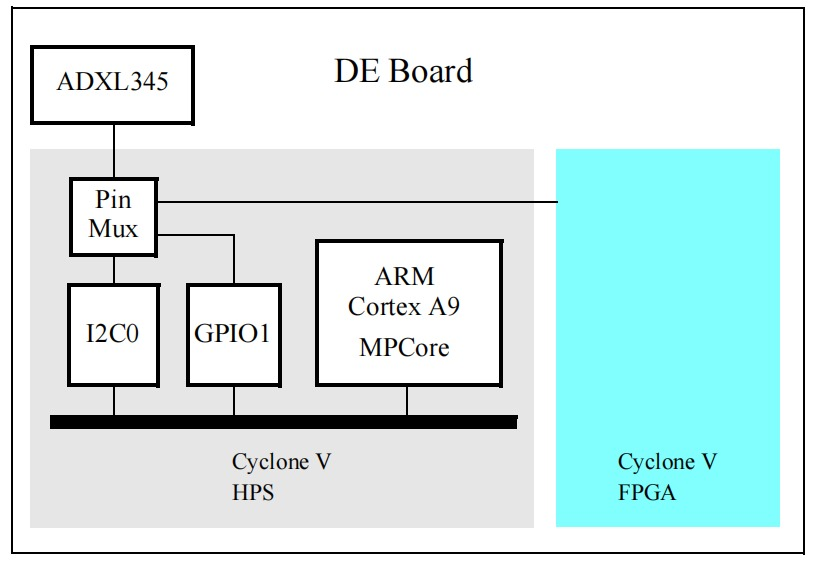
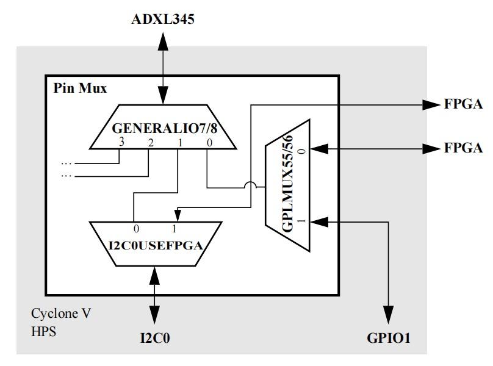
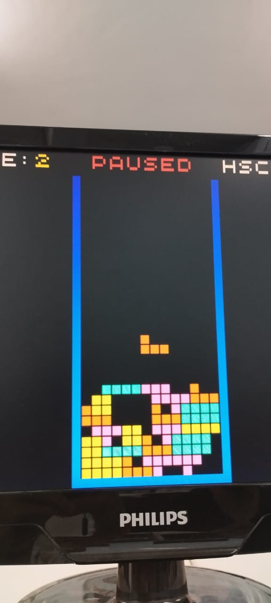
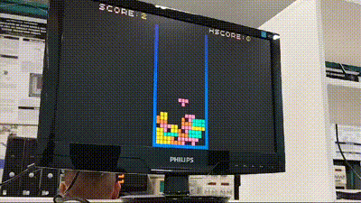

<h1 align="center"> 🟦🟪🟨🟥🟧 
  🟦🟪🟨🟥🟧
</h1>

<h3 align="justify">Jogo inspirado no clássico Tetris, desenvolvido para o kit de desenvolvimento DE1-SoC utilizando linguagem C </h3>

 
<h2> Sobre o Projeto</h2>

Tetris é um clássico jogo de quebra-cabeça criado em 1984 pelo programador russo Alexey Pajitnov. Tedo como objetivo do jogo encaixar peças de diferentes formatos, chamadas "tetraminós", em uma matriz vertical. Tendo as opções de girar e posicionar as peças que caem para formar linhas horizontais completas. Quando uma linha é preenchida, ela é eliminada, e o jogador ganha pontos. O jogo termina quando as peças se acumulam e atingem o topo da tela. Tetris é amplamente reconhecido por sua simplicidade, desafio crescente e apelo universal, permanecendo popular até os dias de hoje.

Este projeto tem como objetivo desenvolver um jogo inspirado no clássico Tetris, utilizando a placa FPGA DE1-SoC para execução do sistema e controle do usuário. O jogo incorpora um acelerômetro embutido na placa, permitindo captar os movimentos desejados pelo jogador, enquanto botões são utilizados para comandos adicionais. A interface gráfica do jogo é transmitida via cabo VGA para um monitor CRT, que exibe as telas e interações ao usuário, proporcionando uma experiência de jogo fluida e integrada com os dispositivos de controle.

Os requisitos para elaboração do sistema são apresentados a seguir:

* O código carregado na DE1-SoC deve ser feito em linguagem C;
* Um acelerômetro deve captar a movimentação feita na placa para alterar a posição das peças que irão se movimentar no tabuleiro.
* Os botões devem ser utilizados para executar comandos no jogo;
* Os dados de imagem devem ser transmitidos de um cabo VGA para um monitor CRT.

<h2>  Equipe:  </h2>
<uL> 
  <li><a href="https://github.com/Oguelo">Alex da Fonseca Dantas Junior</a></li>
  <li><a href="https://github.com/BRCZ1N">Bruno Campos de Oliveira Rocha</a></li>
  <li><a href="https://github.com/duasck">Luis Eduardo Leite Azevedo</a></li>
 
</ul>

<h1 align="center"> Sumário </h1>

    <ul>
        <li><a href="#equipamentos">Descrição dos Equipamentos e Software Utilizados</a></li>
        <li><a href="#arq_CPU"> Estrutura da Placa DE1-SoC </a></li>
        <li><a href="#Drives">Drives de Dispositivos de Entrada e Saída (E/S)</a></li>
        <li><a href="#Acelerometro">Acelerômetro</a></li>
        <li><a href="#Interface-Grafica">Interface do Usuário</a></li>
        <li><a href="#Regras-de-jogo">Dinâmica e Regras de Jogo</a></li>
        <li><a href="#Algoritmos">Algoritmos de Jogo</a></li>
        <li><a href="#Funcionamento">Funcionamento do jogo</a></li>
        <li><a href="#execucao"> Como Usar </a></li>
         <li><a href="#makefile">Makefile</a></li>  
        <li><a href="#conclusao">Conclusão</a></li>
        <li><a href="#referencia">Referências</a></li>
  </ul>

 
<h2> Descrição dos Equipamentos e Software Utilizados</h2>

Nesta seção, são apresentados os equipamentos e software utilizados durante o desenvolvimento do projeto.

<h3>Kit de desenvolvimento DE1-SoC</h3>

A placa DE1-SoC é um kit de desenvolvimento que integra um processador ARM Cortex-A9 dual-core com um FPGA Cyclone V da Intel, proporcionando uma poderosa plataforma para projetos que combinam software e hardware. Com uma ampla variedade de periféricos, como portas VGA, Ethernet, USB, e áudio, a DE1-SoC é ideal para aplicações em sistemas embarcados e FPGA. Devido à sua versatilidade, essa placa é amplamente utilizada em ambientes educacionais e de pesquisa, facilitando o aprendizado e o desenvolvimento de projetos em ambas as áreas.
Abaixo estão os elementos utilizados na construção desse projeto:

| Categoria                               | Detalhes                                       |
| --------------------------------------- | ---------------------------------------------- |
| **FPGA**                          | Cyclone V SoC 5CSEMA5F31C6                     |
| Logic Elements                          | 85K                                            |
| Memória Embarcada                      | 4,450 Kbits                                    |
| PLLs Fracionais                         | 6                                              |
| Controladores de Memória               | 2                                              |
| **Configuração e Depuração**  | Dispositivo de Configuração Serial (EPCS128) |
| On-Board                                | USB Blaster II                                 |
| **Memória**                      | 64MB SDRAM                                     |
| DDR3 SDRAM                              | 1GB                                            |
| Micro SD                                | Sim                                            |
| **Comunicação**                 | 2 Portas USB 2.0                               |
| Ethernet                                | 10/100/1000                                    |
| **Display**                       | VGA DAC 24-bit                                 |
| Entrada de Vídeo                       | Decodificador TV                               |
| **Botões, Interruptores e LEDs** | 
4 Teclas de Usuário (FPGA)                    |
| 2 Botões de Reset (HPS)                |                                                |
| **Energia**                       | Entrada DC 12V                                 |

<h3> Linguagem C</h3>
A linguagem C foi escolhida por sua eficiência, portabilidade e ampla aplicação em sistemas embarcados. Com uma sintaxe simples, ela oferece controle preciso sobre o hardware, além de contar com bibliotecas padrão e ferramentas que facilitam o desenvolvimento de código compacto e otimizado, ideal para dispositivos com recursos limitados.

<h3> Compilador GNU</h3>

O GCC, abreviação de "GNU Compiler Collection" (Coleção de Compiladores GNU), é uma popular distribuição de compiladores que oferece suporte a diversas linguagens de programação, como C, C++, Objective-C, Fortran e Ada. Quando executado, o GCC realiza várias etapas, incluindo pré-processamento, compilação, montagem e vinculação. Ele também disponibiliza uma ampla variedade de opções de linha de comando, permitindo que o desenvolvedor personalize o processo de compilação conforme suas necessidades específicas

<h3>Vistual Studio Code</h3>

O Visual Studio Code, conhecido como VSCode, é um ambiente de desenvolvimento amplamente usado. Desenvolvido pela Microsoft, é um editor de código gratuito e de código aberto com recursos como realce de sintaxe, conclusão de código e depuração integrada. Suporta várias linguagens e possui extensões para personalização. No projeto ele foi utilizado para desenvolver o código fonte do jogo.

<h3> Monitor CRT</h3>

O monitor utilizado no projeto foi o DELL M782p, um modelo de CRT que utiliza tubo de raios catódicos para exibição de imagens. Com uma tela de 17 polegadas e resolução máxima de 1280x1024 pixels, ele oferece uma interface VGA para conexão com computadores ou placas de desenvolvimento. Os monitores CRT, como o DELL M782p, são conhecidos por sua reprodução de cores vibrantes e tempos de resposta rápidos, tornando-os ideais para projetos que exigem interação em tempo real, como jogos e simulações.

Abaixo estão dados detalhados sobre o monitor usado:

|            Características            |      Detalhes      |
| :------------------------------------: | :----------------: |
|       **Tipo de Display**       |      Vertical      |
| **Tamanho da Tela (Horizontal)** |      32,4 cm      |
|  **Tamanho da Tela (Vertical)**  |      24,6 cm      |
|  **Tamanho da Tela (Diagonal)**  |      40,6 cm      |
|      **Varredura Vertical**      |    50 - 160 Hz    |
|     **Varredura Horizontal**     |    30 - 70 kHz    |
|  **Tamanho da Tela (Diagonal)**  |   43,2 cm (17")   |
|          **Dot Pitch**          |  0,270 x 0,270 mm  |
|     **Resolução Máxima**     | 1280 x 1024 pixels |
|    **Resolução do Display**    | 1024 x 768 pixels |

<h2> Estrutura da Placa DE1-SoC </h2>

Nesta parte, será detalhada a arquitetura da placa DE1-SoC, incluindo o processador ARM Cortex-A9, a organização dos registradores, o mapeamento dos dispositivos de entrada/saída na memória, o uso da memória, a comunicação entre o processador e o FPGA, além do processo de compilação nativa diretamente na placa.

<h3>Resumo dos Recursos do Processador ARM Cortex-A9 </h3>

O ARM Cortex-A9 é baseado em uma arquitetura RISC (Reduced Instruction Set Computing), onde operações aritméticas e lógicas são realizadas nos registradores de propósito geral. A movimentação de dados entre memória e registradores é feita através de instruções Load e Store, com comprimento de palavra de 32 bits e endereçamento em estilo little-endian.

<h3>Organização dos Registradores</h3>

O processador ARM Cortex-A9 contém 15 registradores de propósito geral (R0 a R14), um contador de programa (R15) e um registrador de status do programa atual (CPSR), todos com 32 bits. Dois registradores têm tratamento especial: R13 é o Stack Pointer, enquanto R14 atua como registrador de link em chamadas de sub-rotina.

<h3>Instruções e Modo Thumb</h3>

As instruções têm 32 bits e são armazenadas na memória com alinhamento de palavras. O conjunto de instruções Thumb oferece uma versão reduzida com instruções de 16 bits, o que diminui os requisitos de memória, algo útil em sistemas embarcados.

<h3>Memória Utilizada</h3>

O HPS (Hard Processor System) conta com uma interface de memória que conecta o ARM MPCORE a uma memória DDR3 de 1 GB. Esta memória serve como armazenamento de dados e programas para os processadores ARM. Organizada como 256M x 32 bits, ela pode ser acessada por palavras de 32 bits, meias palavras e bytes.

<h3>Mapeamento de Dispositivos de Entrada/Saída</h3>

Os dispositivos de E/S disponíveis ao processador ARM são mapeados diretamente na memória e acessados como se fossem endereços de memória, utilizando as instruções Load e Store.

<h3>Interrupções de Hardware</h3>

Dispositivos de E/S podem gerar interrupções de hardware, ativando as linhas de solicitação de interrupção (IRQ ou FIQ) do processador. Quando ocorre uma interrupção, o processador entra no modo de exceção correspondente e salva o estado atual do programa. Antes de retornar à execução, o endereço salvo no registrador de link deve ser decrementado em 4.

<h3>Diagrama de Blocos da Placa DE1-SoC</h3>

O sistema DE1-SoC é composto pelo HPS e pelo FPGA, ambos integrados no chip Cyclone V SoC. O HPS inclui um processador ARM Cortex-A9 dual-core, uma interface de memória DDR3 e periféricos. O FPGA implementa dois processadores Intel Nios II e vários periféricos conectados.

<h3>Comunicação entre o Processador e o FPGA via JTAG</h3>

A interface JTAG estabelece a comunicação entre a placa DE1-SoC e o computador host, possibilitando a transferência de arquivos de configuração do FPGA e o monitoramento via o programa Intel FPGA Monitor.

<h3>Compilação Nativa na DE1-SoC</h3>

A compilação nativa ocorre quando o código é compilado no mesmo sistema em que será executado. Aqui, a compilação será realizada diretamente na placa, utilizando a linha de comando do Linux e as ferramentas de compilação integradas. O comando `gcc` invoca o GNU C Compiler, um compilador de código aberto muito usado para gerar executáveis no Linux.

 
<h2> Drives de Dispositivos de Entrada e Saída</h2>

# Drivers de Dispositivos de Entrada e Saída (E/S)

Para realizar a comunicação com os dispositivos periféricos de hardware, este projeto utiliza drivers, que são módulos de software responsáveis por fornecer a interface de controle sobre esses dispositivos. Abaixo estão descritos os módulos e funções de cada driver utilizado.

## Porta de Saída de Vídeo

O módulo identificado como `video` é responsável pela comunicação com o dispositivo de saída VGA. As funções utilizadas são:

- `video_open`: Abre o dispositivo de vídeo VGA.
- `video_clear`: Limpa o buffer de pixels que não está sendo transmitido para o monitor.
- `video_erase`: Limpa todos os dados de caracteres da tela.
- `video_show`: Alterna entre os buffers, modificando qual será transmitido para o monitor VGA.
- `video_box`: Desenha um quadrado ou retângulo no buffer de vídeo não transmitido. As coordenadas das extremidades e a cor são passadas como parâmetros.

## Botões

O módulo identificado como `KEYS` é responsável pela leitura dos botões da placa DE1-SoC. As funções disponíveis são:

- `KEY_open`: Abre o dispositivo responsável pelos botões.
- `KEY_read`: Lê o estado dos botões e atualiza o endereço de memória fornecido. A leitura indica se os botões foram pressionados desde a última verificação, sendo necessário limpar os dados antes de iniciar novas interações.
- `KEY_close`: Fecha o dispositivo de botões, liberando os recursos alocados para ele durante a execução.

 
<h2>Acelerometro</h2>

<h3>Visão Geral do ADXL345 </h3>

O acelerômetro ADXL345 fornece dados de aceleração para três eixos: X, Y e Z, fabricado pela Analog Devices Corporation. Ele possui vários registros configuráveis que permitem ajustar o formato dos dados, taxa de amostragem, modos de energia, entre outros

<h3>Registradores usados </h3>

Seguindo a linha de aprendizado dos tutoriais do site FPGAcademy, usamos alguns registradores para comunicar, configurar, controlar e ler o sensor.

<h3>Registradores do Controlador I2C0</h3>

<ul>
  <li><code>I2C0_BASE</code>: Base de memória para o controlador I2C0. Usado como referência para acessar outros registradores.</li>
  <li><code>I2C0_CON</code>: Registrador de Controle. Controla o modo de operação do controlador I2C, como modo mestre/escravo e a velocidade (rápido/lento).</li>
  <li><code>I2C0_TAR</code>: Registrador de Endereço de Destino. Define o endereço do dispositivo escravo I2C com o qual o controlador mestre I2C0 se comunica (ex. ADXL345).</li>
  <li><code>I2C0_DATA_CMD</code>: Registrador de Dados e Comando. Usado para transmitir e receber dados do barramento I2C. Também pode enviar comandos como leitura/escrita.</li>
  <li><code>I2C0_FS_SCL_HCNT</code>: Registrador de Contagem Alta do SCL (Fast Mode). Define o número de ciclos de clock que o sinal SCL deve permanecer alto na comunicação I2C em modo rápido (400 kbit/s).</li>
  <li><code>I2C0_FS_SCL_LCNT</code>: Registrador de Contagem Baixa do SCL (Fast Mode). Define o número de ciclos de clock que o sinal SCL deve permanecer baixo na comunicação I2C em modo rápido.</li>
  <li><code>I2C0_ENABLE</code>: Registrador de Habilitação do Controlador I2C. Controla se o controlador I2C está habilitado (ativo) ou desabilitado.</li>
  <li><code>I2C0_RXFLR</code>: Registrador de Nível de FIFO de Recepção. Indica quantos dados estão prontos no buffer FIFO de recepção, aguardando para serem lidos.</li>
  <li><code>I2C0_ENABLE_STATUS</code>: Registrador de Status de Habilitação. Mostra se o controlador I2C está habilitado e pronto para uso.</li>
  <li><code>I2C0_SPAN</code>: Intervalo de endereços mapeados usados pelo controlador I2C0.</li>
</ul>

<h3>Registradores de Multiplexação de Pinos (SYSMGR): </h3>

<ul>
  <li><code>SYSMGR_GENERALIO7</code>: Configura o pino 7 para conectar o sinal do periférico I2C0.SDA (linha de dados do I2C). Configurado como 1.</li>
  <li><code>SYSMGR_GENERALIO8</code>: Configura o pino 8 para conectar o sinal do periférico I2C0.SCL (linha de clock do I2C). Também configurado como 1.</li>
  <li><code>SYSMGR_I2C0USEFPGA</code>: Define se os sinais I2C0 (SDA e SCL) serão roteados para o HPS (0) ou para o FPGA (1). Configurado como 0, assim controlando o mux para conexão I2C.</li>
  <li><code>SYSMGR_BASE</code>: Base de memória do Gerenciador do Sistema. Usada como referência para acessar os registradores de configuração do sistema.</li>
  <li><code>SYSMGR_SPAN</code>: Intervalo de endereços usados pelos registradores de multiplexação de pinos.</li>
</ul>

<h3>Lista de Registradores do ADXL345: </h3>

<ul>
  <li><code>ADXL345_REG_DATA_FORMAT</code>: Controla o formato dos dados e o alcance da medição do acelerômetro (ex. ±2g, ±4g, ±8g, ±16g) e a resolução (completa ou 10 bits). Configurada na faixa de ±16g, ou seja, resolução total.</li>
  <li><code>XL345_DATAREADY</code>: Bit que indica se os dados estão prontos para serem lidos. Está no registrador de interrupção.</li>
  <li><code>XL345_RANGE_16G</code>: Configura o acelerômetro para operar no modo de ±16g.</li>
  <li><code>ADXL345_REG_THRESH_ACT</code>: Define o valor limite para detecção de atividade em termos de aceleração (utilizado para interrupções de detecção de movimento).</li>
  <li><code>XL345_FULL_RESOLUTION</code>: Ativa o modo de resolução total, onde a menor unidade de aceleração representada é 3,9 mg.</li>
  <li><code>ADXL345_REG_BW_RATE</code>: Controla a taxa de amostragem e o modo de energia. Por exemplo, a configuração <code>XL345_RATE_200</code> define uma taxa de 200 Hz.</li>
  <li><code>XL345_RATE_200</code>: Configura a taxa de amostragem do ADXL345 para 200 Hz.</li>
  <li><code>ADXL345_REG_THRESH_INACT</code>: Define o valor limite para detecção de inatividade (usado para interrupções de detecção de inatividade).</li>
  <li><code>ADXL345_REG_TIME_INACT</code>: Define o tempo que a aceleração precisa estar abaixo do limite de inatividade para que a inatividade seja detectada.</li>
  <li><code>ADXL345_REG_ACT_INACT_CTL</code>: Controla a detecção de atividade e inatividade para os eixos X, Y e Z.</li>
  <li><code>ADXL345_REG_INT_ENABLE</code>: Controla quais interrupções estão habilitadas. Pode habilitar interrupções para detecção de atividade, inatividade, queda livre, etc.</li>
  <li><code>XL345_INACTIVITY</code>: Bit que habilita a interrupção de inatividade.</li>
  <li><code>XL345_ACTIVITY</code>: Bit que habilita a interrupção de atividade.</li>
  <li><code>ADXL345_REG_POWER_CTL</code>: Controla o estado de energia do ADXL345, como ativar/desativar medições de aceleração.</li>
  <li><code>XL345_STANDBY</code>: Coloca o ADXL345 em modo de espera (standby) para economizar energia.</li>
  <li><code>XL345_MEASURE</code>: Ativa o modo de medição, permitindo que o ADXL345 comece a medir aceleração.</li>
  <li><code>ADXL345_REG_OFSX</code>: Configura o ajuste de compensação no eixo X.</li>
  <li><code>XL345_RATE_100</code>: Configura a taxa de amostragem para 100 Hz.</li>
  <li><code>ADXL345_REG_INT_SOURCE</code>: Indica a origem das interrupções (por exemplo, quando novos dados estão disponíveis ou quando uma atividade/inatividade foi detectada).</li>
  <li><code>ADXL345_REG_DATAX0</code> e <code>ADXL345_REG_DATAX1</code>: Registradores de leitura dos dados de aceleração para o eixo X (o dado é armazenado em dois registradores para formar um valor de 16 bits).</li>
</ul>

<h3>Comunicação com o ADXL345 </h3>

A comunicação com o ADXL345 é feita por meio do barramento I2C. No DE1-SoC, os fios de comunicação I2C do ADXL345 estão conectados ao HPS (Hard Processor System) do chip Cyclone V. Através do Pin Multiplexer, os sinais podem ser rooteados para o controlador I2C0, que será utilizado para acessar os registros internos do ADXL345

  
  
 Conexão I2C do ADXL345 com o chip Cyclone V SoC em placas da série DE. 

  
  
  
 O bloco Pin Mux em mais detalhes. 

<h3>Mapeamento Virtual de Memória </h3>

Para que o programa em C possa acessar os registradores do ADXL345 no ambiente Linux, é necessário mapear os endereços de memória física para endereços virtuais, permitindo o uso de ponteiros no espaço de usuário.
Configuração do I2C e Pin Multiplexer
Antes de iniciar a comunicação com o ADXL345, é necessário configurar o Pin Multiplexer para rotear os sinais I2C corretamente. A configuração é feita escrevendo nos registradores do Pin Mux:
<pre><code>
void Configurar_mux(){
    *(ponteiro_gerenciador + SYSMGR_I2C0USEFPGA) = 0;
    *(ponteiro_gerenciador + SYSMGR_GENERALIO7) = 1;
    *(ponteiro_gerenciador + SYSMGR_GENERALIO8) = 1;
}</code></pre>

  
  
 Mapeamento de memória 

Além disso, o controlador I2C0 precisa ser configurado para operar no modo mestre e com o endereço correto do ADXL345 Leitura e Escrita dos Registros do ADXL345
Após a configuração do I2C, podemos ler e escrever nos registradores do ADXL345 usando os registradores de comando e dados do controlador I2C.

<h3>Resumo da construção </h3>
Para criar a biblioteca foi usado esses registradores citados, além de usar a função mmap da biblioteca sys/mman para mapear a memória física e criar um endereço virtual.
O primeiro passo é mapear a memória física para o espaço de endereçamento virtual, pois tentar acessá-la diretamente causará um erro de segmentação, já que o sistema não permite 
o acesso direto à memória física. Após o mapeamento, devemos o endereço virtual resultante para configurar a conexão do mux. Logo depois inicializamos os registradores, configuramos e fazemos uma calibragem, se tudo certo, podemos ler os dados.

## Interface do Usuário 

A interface gráfica exibe a pontuação(Score), a maior pontuação(High Score) e o tabuleiro, que apresenta duas barras laterais e uma inferior.

    

## Dinâmica e Regras de Jogo 

### Objetivo do Jogo
O objetivo é controlar as peças (Tetrominos) que caem e formar linhas completas. Quando uma linha é preenchida, ela é eliminada, e o jogador recebe pontos.

### Controles
- **Deslocamento Lateral**: O acelerômetro movimenta a peça para a esquerda ou direita.

### Colisões e Limitações
Peças colidem com o fundo do tabuleiro ou com outras peças, sendo fixadas quando atingem o limite. Linhas completas são removidas e a pontuação do jogador aumenta.

### Pontuação
A pontuação é baseada nas linhas eliminadas. Quanto mais linhas eliminadas, maior a pontuação.

### Fim de Jogo
O jogo termina quando as peças acumulam-se até o topo do tabuleiro.

### Tipos de Tetrominos
- **Tetromino Q (ou O)**: Quadrado 2x2, cor amarela.
- **Tetromino T**: Forma de "T", cor rosa.
- **Tetromino L**: Forma de "L", cor laranja.
- **Tetromino I**: Linha reta, cor ciano.

 
  <h2> Algoritmos de Jogo </h2>

  <h3>Algoritmo de detecção de colisão</h3>

Este algoritmo permite que as peças reconheçam quando colidem com o fundo do tabuleiro, outras peças ou a lateral do tabuleiro. Como cada parte de uma peça é um ponto numa matriz, foi desenvolvido um algoritmo de detecção de colisão entre peças e o tabuleiro. A lógica do algoritmo baseia-se em verificar a posição de cada bloco da peça atual e comparar com o estado do tabuleiro. Quando uma peça tenta mover-se para uma nova posição, o algoritmo checa se essa posição já está ocupada por outro bloco ou se ultrapassa os limites do tabuleiro. Se uma colisão é detectada, o movimento da peça é interrompido, e ela é fixada em sua posição final no tabuleiro.

  <h3>Algoritmo de movimentação de peça</h3>

Este algoritmo é responsável por gerenciar o movimento da peça atual dentro do tabuleiro. A peça se move automaticamente para baixo a cada ciclo de atualização do jogo, e o jogador pode controlar a peça lateralmente via acelerômetro. Para isso, o algoritmo precisa verificar se os movimentos solicitados são válidos, sem ultrapassar os limites do tabuleiro ou colidir com outras peças. A lógica do algoritmo baseia-se em aplicar o movimento solicitado pela peça, seja para a esquerda ou direita, sendo esse direcionamento de deslocamento influenciado pela coordenada fornecida pelo acelerômetro. Antes de realizar o movimento, o algoritmo utiliza o algoritmo de detecção de colisão para garantir que a nova posição não esteja ocupada por outro bloco ou fora dos limites do tabuleiro. Se o movimento for permitido, a peça é deslocada; caso contrário, o movimento é bloqueado. Quando a peça atinge o fundo do tabuleiro ou colide com outra peça, ela é fixada no local, e uma nova peça é gerada no topo do tabuleiro.

  <h3>Algoritmo de geração de peças</h3>

Este algoritmo é responsável por criar novas peças (tetrominos) que aparecerão no topo do tabuleiro assim que a peça anterior for fixada. As peças são geradas aleatoriamente a partir de um conjunto pré-definido de formas, e cada nova peça começa sua trajetória no topo do tabuleiro, descendo automaticamente. A lógica do algoritmo baseia-se na geração aleatória de uma peça a partir de um conjunto de tetrominos. Após a fixação de uma peça no tabuleiro, o algoritmo seleciona a próxima peça e a posiciona na parte superior central do tabuleiro. A peça começa a descer automaticamente, e o processo de movimentação e detecção de colisão se repete até que a peça seja fixada ou o jogo termine, caso o tabuleiro esteja cheio.

  <h3>Algoritmo de remoção de linhas completas</h3>

Esse algoritmo é responsável por verificar se uma ou mais linhas do tabuleiro foram completamente preenchidas por blocos após a fixação de uma peça. Quando uma linha é completamente preenchida, ela é removida do tabuleiro, e todas as linhas superiores são deslocadas para baixo, liberando espaço para novas peças.A lógica do algoritmo baseia-se em percorrer cada linha do tabuleiro e verificar se todas as células daquela linha estão ocupadas por blocos. Quando uma linha completa é detectada, o algoritmo a remove, esvaziando-a, e depois desloca todas as linhas acima dela para baixo, além disso a linha removida existe o incremento da pontuação do jogador. Esse processo é repetido até que todas as linhas completas tenham sido removidas. O objetivo é liberar espaço e aumentar a pontuação do jogador, tornando o jogo mais desafiador à medida que o campo de jogo se enche novamente.

 
<h2> Funcionamento do jogo</h2>

 
  

    
    
Tela do jogo.

 

    
    
Como controlar o jogo.

    
    
Demonstração da jogabilidade do jogo.

Para controlar as peças, o jogador deve inclinar a placa no eixo horizontal, o que permite mover as peças para a esquerda ou para a direita. Além disso, o jogo possui uma função de pausa: para pausar, o jogador deve pressionar o botão 1 na placa.
Se as peças alcançarem o topo da tela, o jogo termina e reinicia. Caso a pontuação do jogador seja superior à maior pontuação registrada, ela será definida como o novo high score.

 
<h2>Makefile</h2>

Para atender aos requisitos e simplificar o processo de compilação e execução do programa em C, foi criado um `Makefile`. Este arquivo serve como uma ferramenta que automatiza a construção do projeto, facilitando o gerenciamento do processo de compilação. O `Makefile` executa as seguintes operações:

- **Compilação**: Compila os arquivos de código-fonte em arquivos objeto.
- **Linkagem**: Combina os arquivos objeto em um executável.
- **Limpeza**: Remove arquivos temporários e o executável gerado.
- **Execução**: Permite iniciar o programa compilado.

 
<h2>Como usar</h2>

Para iniciar o projeto, siga os passos abaixo para obter o código-fonte, compilar o código em C e executa-lo em um dispositivo FPGA DE1-SoC. 

**Passo 1: Clonar o Repositório**

Abra o terminal e execute o seguinte comando para obter o código do repositório:

    git clone https://github.com/BRCZ1N/MI-SistemasDigitais-Problema-1.git

**Passo 2: Acessar o Diretório e Compilar o Código em C**

    cd MI-SistemasDigitais-Problema-1\Modulos

Compile e execute o código usando o comando:

    make 

 
<h2> Conclusão</h2>

O desenvolvimento deste projeto de Tetris para a placa DE1-SoC, utilizando linguagem C, demonstrou a versatilidade e o poder de integração entre hardware e software oferecidos por essa plataforma. Ao implementar o jogo, foi possível explorar a interface gráfica transmitida via VGA, o controle responsivo utilizando um acelerômetro e botões, além da manipulação de memória e dispositivos de entrada/saída diretamente no hardware. Entretanto, não foi possível implementar recursos, tais como, rotação de tetrominos e aumento de nível com base na pontuação, esses recursos gerariam ainda mais diversidade e são possíveis de serem feitos com esse projeto base.
O projeto proporcionou uma oportunidade  de combinar conceitos de sistemas embarcados, como controle de periféricos, algoritmos de movimentação e colisão, e lógica de geração e remoção de peças, em uma aplicação prática e divertida. A utilização da DE1-SoC permitiu expandir o conhecimento sobre FPGAs, além de aprimorar as habilidades de programação em C para sistemas com recursos limitados.
<li><a href="#sumario">Voltar para o inicio</a></li>
 

 
<h2> Referências</h2>
<ul>
<li><a href="https://ftp.intel.com/Public/Pub/fpgaup/pub/Intel_Material/18.1/Computer_Systems/DE1-SoC/DE1-SoC_Computer_ARM.pdf">DE1-SoC Computer System with ARM* Cortex* A9 </a> - Acesso em 26 set. 2024. </li>
<li><a href="https://blogs.vmware.com/vsphere/2020/03/how-is-virtual-memory-translated-to-physical-memory.html"> NIELS HAGOORT. How is Virtual Memory Translated to Physical Memory? VMware vSphere Blog. </a> - Acesso em: 20 set. 2024.</li>
<li><a href="https://ftp.intel.com/Public/Pub/fpgaup/pub/Intel_Material/17.0/Tutorials/Linux_On_DE_Series_Boards.pdf" > Using Linux* on DE-series Boards </a> - Acesso em 24 set 2024.</li>
‌</ul>

